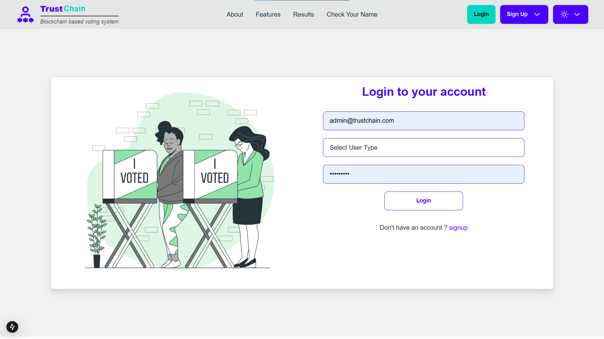
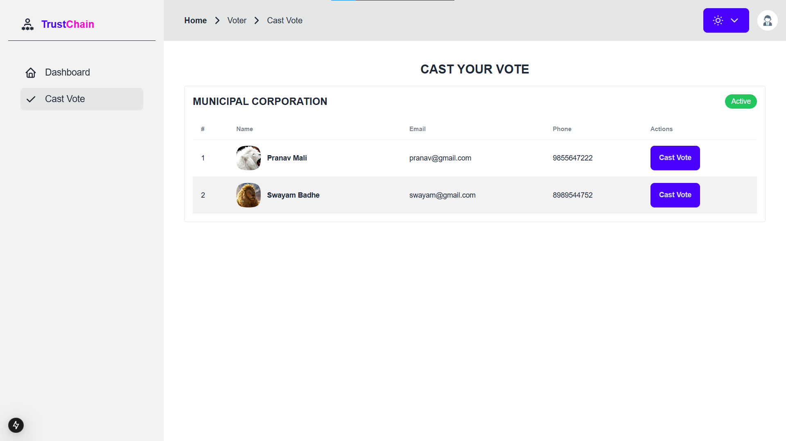
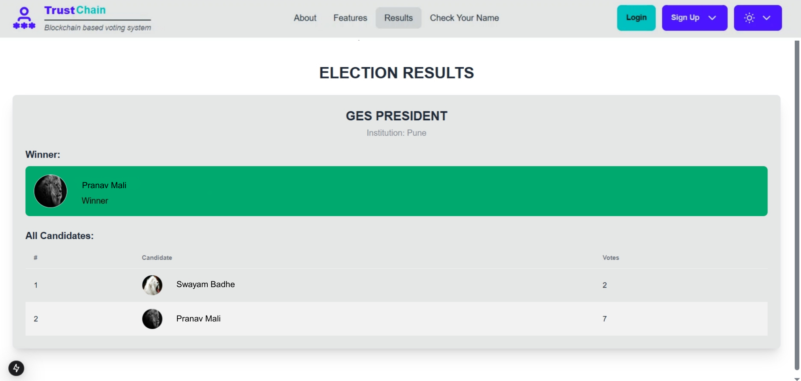

# TrustChain- A decentralised voting system made using solidity (ethereum) to conduct elections using blockchain.
- This project was made as final year project. This blockchain based system uses MongoDB, Ganache, Ethereum Testnet, NodeJS to conduct elections.
- The system include 4 actors: SuperAdmin, Admin, Candidates, Voters.
- The deployment steps are listed below and .env file is expected to run the project which would include API keys.
- Create PR's or raise issues if want to.
# 🛡️ TrustChain

A secure blockchain-based voting system ensuring transparency, integrity, and verifiability of election processes.

---

## 📖 About the Project
TrustChain is a blockchain-based voting platform that aims to eliminate voter fraud, ensure transparency, and provide an immutable record of votes.  
It leverages blockchain technology to make elections more secure and trustworthy.

---

## 🚀 Features
- **Secure Voting** – Uses blockchain to prevent tampering.
- **Voter Authentication** – Ensures only authorized voters can cast votes.
- **Transparency** – All votes are recorded on an immutable ledger.
- **Real-time Results** – View results instantly after the voting ends.

---

## 🛠️ Tech Stack
- **Frontend:** HTML, CSS, JavaScript
- **Backend:** Node.js, Express.js
- **Blockchain:** Ethereum (Solidity Smart Contracts)
- **Database:** MongoDB
- **Other Tools:** Git, GitHub, MetaMask

---

## 📸 Screenshots

### 🏠 Home Page


### 🗳️ Voting Dashboard


### 📊 Results Page


---

## ⚡ Getting Started

### 1️⃣ Clone the Repository
```bash
git clone https://github.com/mehul-tamboli/TrustChain.git
cd TrustChain
(https://nextjs.org/docs/app/building-your-application/deploying) for more details.

### 2️⃣ Install Dependencies
npm install

### 3️⃣ Run the Project
npm start
Open your browser and visit http://localhost:3000
